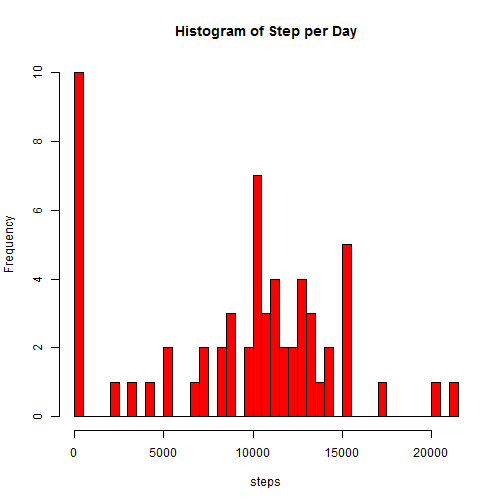
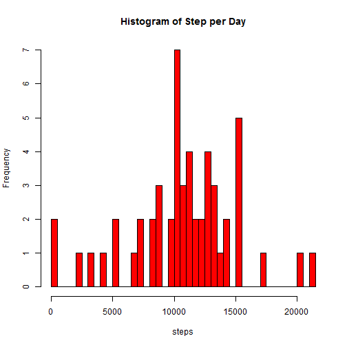

# Reproducible Research: Peer Assessment 1


## Loading and preprocessing the data


```r

if (!file.exists("activity.csv")) unzip("activity.zip")

activities <- read.csv("activity.csv")

activities$date <- as.Date(activities$date, format = "%Y-%m-%d")

# install.packages('plyr')

# library('plyr')

# result <- ddply(activities, .(date), summarize, sum=sum(steps, na.rm=F))

result <- with(activities, tapply(steps, date, sum, na.rm = T))

hist(result, col = "red", main = "Histogram of Step per Day", xlab = "steps", 
    breaks = 61)
```

 

```r

```


## What is mean total number of steps taken per day?


```r
mean(result, na.rm = T)
```

```
## [1] 9354
```

```r

median(result, na.rm = T)
```

```
## [1] 10395
```

## What is the average daily activity pattern?

meanInterval <- tapply(activities$steps, activities$interval, mean, na.rm = T)

interval <- as.numeric(names(meanInterval))

plot(interval, meanInterval, type = "l", xlab = "Interval", ylab = "Steps")

maxInterval <- as.numeric(names(meanInterval)[meanInterval == max(meanInterval)])

abline(v = maxInterval, col = "red")


## Imputing missing values

```r
sum(is.na(activities$steps))
```

```
## [1] 2304
```

```r

activitiesFill <- activities

for (i in 1:dim(activitiesFill)[1]) {
    if (is.na(activitiesFill$steps[i])) {
        activitiesFill$steps[i] <- as.numeric(meanInterval[names(meanInterval) == 
            activitiesFill$interval[i]])
    }
}
```

```
## Error: object 'meanInterval' not found
```

```r

sum(is.na(activitiesFill$steps))
```

```
## [1] 2304
```


```r
newResult <- with(activitiesFill, tapply(steps, date, sum))

hist(newResult, col = "red", main = "Histogram of Step per Day", xlab = "steps", 
    breaks = 61)
```

 

```r

mean(newResult, na.rm = T)
```

```
## [1] 10766
```

```r

median(newResult, na.rm = T)
```

```
## [1] 10765
```


## Are there differences in activity patterns between weekdays and weekends?


```r
w <- weekdays(activitiesFill$date)
w[w == "Sunday"] <- "weekend"
w[w != "weekend"] <- "weekday"
activitiesFill$Week <- as.factor(w)

steps_int <- aggregate(steps ~ interval + Week, data = activitiesFill, mean)

library(lattice)

xyplot(steps ~ interval | Week, type = "l", data = steps_int, layout = c(1, 
    2), xlab = "Interval", ylab = "Number of steps")
```

 

```r

```

