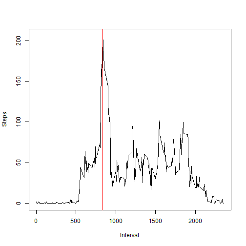

# Reproducible Research: Peer Assessment 1


## Loading and preprocessing the data

First we need to check if the file has already exists or we need to unzip it first. The format is in csv so we can easily read that file easily. The only tidy operation we need to do is to convert the date in activites. 


```r
library(lattice)
```

```
## Warning: package 'lattice' was built under R version 3.0.3
```

```r

if (!file.exists("activity.csv")) unzip("activity.zip")

activities <- read.csv("activity.csv")

activities$date <- as.Date(activities$date, format = "%Y-%m-%d")

result <- with(activities, tapply(steps, date, sum, na.rm = T))
```


We can use the base plot histogram to show the number of step per day. 


```r
hist(result, col = "red", main = "Histogram of Step per Day", xlab = "steps", 
    breaks = 61)
```

 


## What is mean total number of steps taken per day?

Now we calculate the mean and the median by ignoring the NA values


```r
mean(result, na.rm = T)

median(result, na.rm = T)
```


The mean is **9354** and the median is **10395**. 

## What is the average daily activity pattern?

Firstly we need to create a new dataframe to aggregate the mean for each interval. We can use tapply on this part. 


```r
meanInterval <- tapply(activities$steps, activities$interval, mean, na.rm = T)

interval <- as.numeric(names(meanInterval))

plot(interval, meanInterval, type = "l", xlab = "Interval", ylab = "Steps")

maxInterval <- as.numeric(names(meanInterval)[meanInterval == max(meanInterval)])

abline(v = maxInterval, col = "red")
```

 


We can see from the graph that the maximum steps is in the interval **835**

## Imputing missing values

We can see that the steps contains some missing value (NA). We can calculate the NA value from steps with this code. 


```r
naCount <- sum(is.na(activities$steps))
```


There are **2304** missing value in steps. we will affect our analysis. We can use some approximation techniques. The simple one is to use the mean for that missing value. For this part we will use mean for that 5 minutes interval.


```r
activitiesFill <- activities

for (i in 1:dim(activitiesFill)[1]) {
    if (is.na(activitiesFill$steps[i])) {
        activitiesFill$steps[i] <- as.numeric(meanInterval[names(meanInterval) == 
            activitiesFill$interval[i]])
    }
}
```


If we redo our previous exploratory analysis with histogram. We can see some changes in our graph. 


```r
newResult <- with(activitiesFill, tapply(steps, date, sum))

hist(newResult, col = "red", main = "Histogram of Step per Day", xlab = "steps", 
    breaks = 61)
```

 


```r
meanX <- mean(newResult, na.rm = T)

medianX <- median(newResult, na.rm = T)
```


We find the new mean is **10766.19** and the new median is **10766.19**. The result is the same. 

## Are there differences in activity patterns between weekdays and weekends?

Now we will try to find the comparison between the activity between the weekdays and the weekends. Firstly we need to create a factor to group the data and we can compare the plot side by side. The picture worth a thousands word. 


```r
w <- weekdays(activitiesFill$date)
w[w == "Sunday"] <- "weekend"
w[w != "weekend"] <- "weekday"
activitiesFill$Week <- as.factor(w)

# steps_int <- aggregate(steps ~ interval + Week, data = activitiesFill,
# FUN=mean)
steps_int <- aggregate(steps ~ interval + Week, data = activitiesFill, mean)

xyplot(steps ~ interval | Week, type = "l", data = steps_int, layout = c(1, 
    2), xlab = "Interval", ylab = "Number of steps")
```

 

